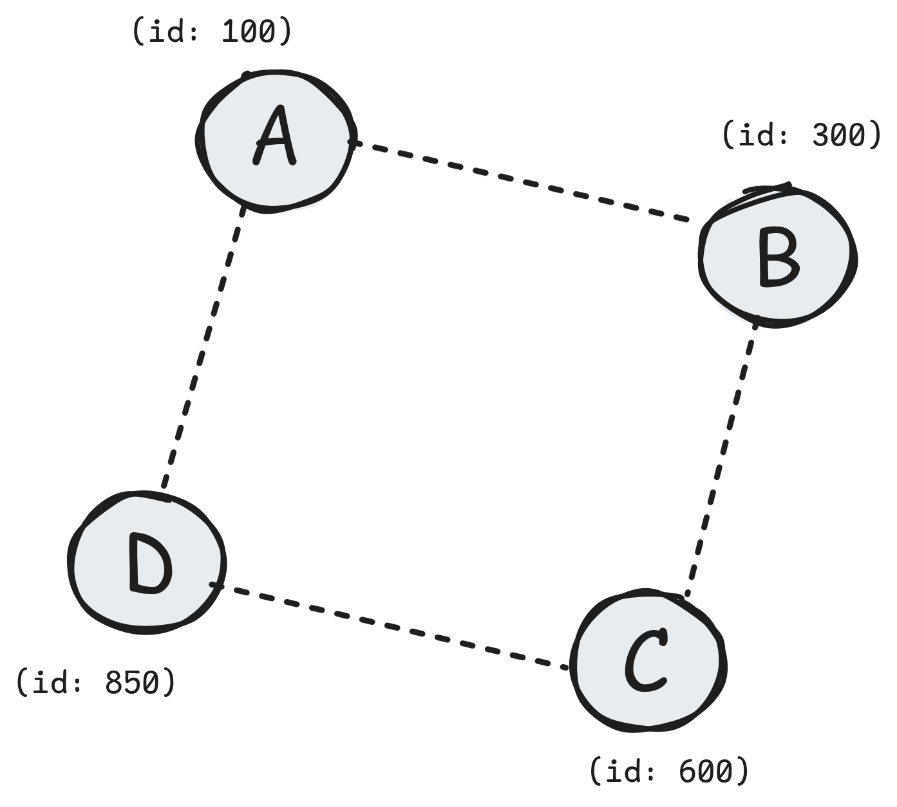

# chord-dfs

A distributed file system built on the [Chord](https://pdos.csail.mit.edu/papers/ton:chord/paper-ton.pdf) Distributed Hash Table (DHT) protocol.

[](https://github.com/goncalooliveirasilva/chord-dfs/actions/workflows/ci.yml)
[](https://sonarcloud.io/summary/new_code?id=goncalooliveirasilva_chord-dfs)
[](https://sonarcloud.io/summary/new_code?id=goncalooliveirasilva_chord-dfs)
[](https://sonarcloud.io/summary/new_code?id=goncalooliveirasilva_chord-dfs)

## What is chord-dfs?

Chord-dfs is a distributed file storage system where files are automatically distributed across a cluster of nodes using consistent hashing. Each node in the cluster is responsible for a range of keys, and files are routed to the appropriate node based on their filename hash.

**Key features:**

- **Decentralized**: no single point of failure, any node can handle requests
- **Scalable**: O(log N) routing efficiency using finger tables
- **Self-organizing**: nodes automatically join and stabilize the ring
- **Dynamic**: add or remove nodes without stopping the cluster

## How it Works

Chord-dfs implements the Chord protocol, which organizes nodes in a logical ring based on their hash values:



When you upload a file:

1. The filename is hashed to produce a key (e.g., `hash("photo.jpg") = 425`)
2. The key is routed through the ring to find the responsible node
3. The file is stored on the node whose ID is the first to follow the key (Node C in this case)

When you download a file:

1. The same hash is computed for the filename
2. The request is routed to the responsible node
3. The file is returned

## Quick Start

### Prerequesites

- Docker

### Start a Cluster

```bash
# Start the first node (bootstrap)
./scripts/spawn_node.sh -b

# Add more nodes to the ring
./scripts/spawn_node.sh -j chord-node-0:5000
./scripts/spawn_node.sh -j chord-node-0:5000
```

### Upload and Download Files

```bash
# Upload a file (via any node)
curl -X POST http://localhost:5000/files -F "file=@myfile.txt"

# Download a file
curl http://localhost:5000/files/myfile.txt -o myfile.txt

# List files on a node
curl http://localhost:5000/files

# Delete a file
curl -X DELETE http://localhost:5000/files/myfile.txt
```

### Check Node Status

```bash
# Health check
curl http://localhost:5000/health

# Node info (ID, successor, predecessor, finger table)
curl http://localhost:5000/chord/info
```

### Stop the Cluster

```bash
# Remove a specific node
./scripts/remove_node.sh chord-node-1

# Remove all nodes and cleanup
./scripts/remove_node.sh -a
```

## Architecture

```
src/
├── api/                    # FastAPI REST layer
│   ├── routes/
│   │   ├── chord.py        # Internal DHT operations (/chord/*)
│   │   └── files.py        # File operations (/files/*)
│   └── schemas/            # Pydantic request/response models
├── core/                   # Pure Chord logic (no I/O)
│   ├── node.py             # ChordNode (Chord logic)
│   ├── finger_table.py     # Routing table for O(log N) lookups
│   └── hashing.py          # Consistent hashing utilities
├── network/                # Network layer
│   ├── http_transport.py   # Async HTTP client (httpx)
│   ├── protocol.py         # Transport protocol interface
│   └── messages.py         # Message types (NodeInfo, NodeAddress)
├── services/
│   └── node_service.py     # Orchestrates node operations
├── storage/
│   ├── local.py            # Local filesystem storage
│   └── protocol.py         # Storage backend interface
└── config.py               # Pydantic settings
```

### Key Components

| Component               | Description                                          |
| ----------------------- | ---------------------------------------------------- |
| **ChordNode**           | Pure state machine implementing Chord algorithms     |
| **FingerTable**         | Routing table with O(log N) lookup efficiency        |
| **NodeService**         | Orchestrates DHT operations, runs stabilization loop |
| **HttpTransport**       | Async inter-node communication via HTTP              |
| **LocalStorageBackend** | File persistence on local filesystem                 |

### Process Documentation

- [Node Join](docs/architecture/node-join.md): How a new node joins the ring
- [Stabilization](docs/architecture/stabilization.md): Background protocol that maintains ring consistency
- [File Upload](docs/architecture/file-upload.md): How files are routed and stored
- [File Retrieval](docs/architecture/file-retrieval.md): How files are located and returned

## API Reference

> Interactive OpenAPI documentation is available at `/docs` on any running node.

### File Operations

| Method   | Endpoint            | Description                            |
| -------- | ------------------- | -------------------------------------- |
| `POST`   | `/files`            | Upload a file                          |
| `GET`    | `/files`            | List local files                       |
| `GET`    | `/files/{filename}` | Download a file                        |
| `DELETE` | `/files/{filename}` | Delete a file                          |
| `POST`   | `/files/forward`    | Forward file to node (internal)        |
| `GET`    | `/files/list/local` | List local files only                  |
| `POST`   | `/files/transfer`   | Transfer files in key range (internal) |

### System Operations

| Method | Endpoint             | Description                   |
| ------ | -------------------- | ----------------------------- |
| `GET`  | `/health`            | Health check                  |
| `GET`  | `/chord/info`        | Node state and finger table   |
| `GET`  | `/chord/predecessor` | Get node's predecessor        |
| `POST` | `/chord/join`        | Join request (internal)       |
| `POST` | `/chord/notify`      | Notify predecessor (internal) |
| `POST` | `/chord/successor`   | Find successor (internal)     |
| `POST` | `/chord/keepalive`   | Keepalive check (internal)    |

## Development

### Setup

```bash
# Install uv (if not installed)
curl -LsSf https://astral.sh/uv/install.sh | sh

# Install dependencies
uv sync

# Run locally
uv run python main.py
```

### Testing

```bash
# Run unit tests
uv run pytest

# Run with coverage
uv run pytest --cov
```

### Linting

```bash
# Check code style
uv run ruff check .

# Format code
uv run ruff format .
```

## References

[Chord: A Scalable Peer-to-peer Lookup Protocol for Internet Applications](https://pdos.csail.mit.edu/papers/ton:chord/paper-ton.pdf)

## License

This project is licensed under the MIT License. See the [LICENSE](./LICENSE) file for details.
