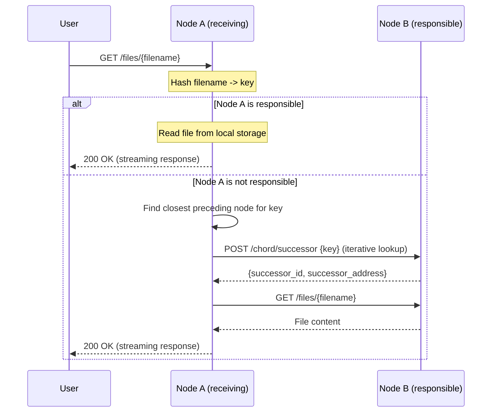

# File Retrieval Process

When a user requests a file, the receiving node hashes the filename to determine which node is responsible for it. If the file is stored locally, it is returned directly. Otherwise, the node routes the request through the ring, retrieves the file from the responsible node, and proxies it back to the user. As with uploads, any node can handle the request: **the routing is transparent.**

## Process Overview

1. The user sends a `GET /files/{filename}` request to any node in the ring.
2. The node hashes the filename to a DHT key.
3. The node checks if it is responsible for that key.
4. **If responsible** the file is read from local storage and returned.
5. **If not responsible** the node finds the responsible node via iterative finger table lookup, retrieves the file from it, and returns the content to the user.

## Message Flow

> **Note:** If the file is not found (either locally or on the responsible node), a 404 response is returned.

## Step Details

### 1. Receive and Hash

The node extracts the filename from the URL path and computes a DHT key by hashing it with SHA-1, taking the result modulo 1024. This is the same hash function used during upload, so the same filename always maps to the same responsible node.

**Components:** `dht_hash`

### 2. Responsibility Check

The node checks whether the key falls in its responsibility range `(predecessor, self]`, using the same logic as file uploads. If responsible, it proceeds to read from local storage.

**Components:** `ChordNode.is_responsible_for`, `is_between`

### 3. Local Retrieval

If the node is responsible, it reads the file from `/app/storage/<filename>` using async file I/O. The filename is sanitized to prevent path traversal. If the file does not exist on disk, `None` is returned and the user receives a 404 response.

**Components:** `LocalStorageBackend.get`

### 4. Routing and Remote Retrieval

If the node is not responsible, it uses the same iterative finger table lookup as file uploads to find the responsible node. It then sends a `GET /files/{filename}` request to that node. The remote node reads the file from its local storage and returns the content. If the remote node returns a 404 or the request fails, the user receives a 404 response.

**Components:** `NodeService._find_successor_iterative`, `FingerTable.find_closest_preceding`, `HttpTransport.get_file`

### 5. Response

The file content is returned as a streaming response with:

- **Content-Type** auto-detected from the filename (e.g., `text/plain` for `.txt`, `image/png` for `.png`), defaulting to `application/octet-stream` for unknown types.
- **Content-Disposition** set to `attachment` to trigger a download in browsers.
- **Content-Length** set to the exact file size in bytes.

**Components:** `StreamingResponse`, `mimetypes.guess_type`
