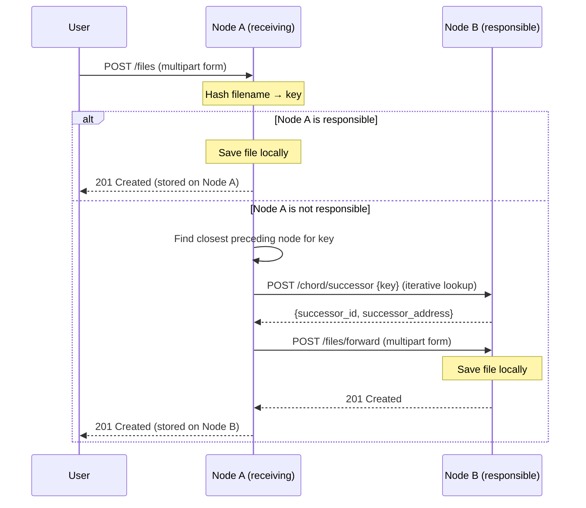

# File Upload Process

When a user uploads a file, the receiving node hashes the filename to produce a key, determines which node in the ring is responsible for that key, and either stores the file locally or forwards it to the responsible node. Any node in the ring can receive the upload: **the routing is transparent to the user.**

## Process Overview

1. The user sends a file via `POST /files` to any node in the ring.
2. The node hashes the filename to a key using SHA-1 (mapped to the 10-bit space, 0–1023).
3. The node checks if it is responsible for that key.
4. **If responsible**: the file is saved to local storage.
5. **If not responsible**: the node finds the responsible node via iterative finger table lookup and forwards the file.

## Message Flow

## Step Details

### 1. Receive and Hash

The file is received as multipart form data. The node extracts the filename and computes a DHT key by hashing it with SHA-1, taking the result modulo 1024 (2^10). This key determines which node in the ring is responsible for storing the file.

**Components:** `dht_hash`

### 2. Responsibility Check

A node is responsible for a key _k_ if _k_ falls in the circular range `(predecessor, self]`. For example, if a node has ID 300 and its predecessor has ID 100, it is responsible for keys 101 through 300.

If the node has no predecessor set (e.g., it just joined and stabilization hasn't run yet) and it isn't alone in the ring, it does not claim responsibility and defers to the routing lookup instead.

**Components:** `ChordNode.is_responsible_for`, `is_between`

### 3. Local Storage

If the node is responsible, the file is saved to `/app/storage/<filename>` using async file I/O. The filename is sanitized to prevent path traversal. If a file with the same name already exists, it is overwritten.

**Components:** `LocalStorageBackend.save`

### 4. Routing

If the node is not responsible, it needs to find the node that is. It starts by consulting its finger table for the closest preceding node to the key. From there, it iteratively queries nodes via `POST /chord/successor`, with each hop jumping closer to the target in the ring. This takes at most O(log N) hops.

Each queried node either claims responsibility (if the key falls in its range) or returns the closest preceding node from its own finger table. The lookup terminates when a node identifies itself as responsible, or after a maximum of 10 hops.

**Components:** `NodeService._find_successor_iterative`, `FingerTable.find_closest_preceding`

### 5. Forwarding

Once the responsible node is found, the file is forwarded to it via `POST /files/forward` as multipart form data. The receiving node saves the file directly to local storage without re-checking responsibility, since the routing already determined it is the correct destination.

**Components:** `HttpTransport.forward_file`, `NodeService.store_file_locally`
