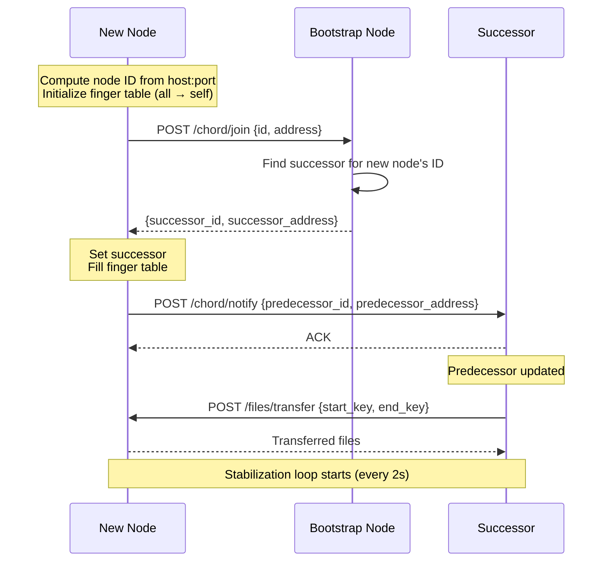

# Node Join Process

When a new node starts with a bootstrap address configured, it joins the existing Chord ring by contacting a known node, finding its position in the ring, and integrating itself into the topology. Once joined, a background stabilization loop continuously corrects pointers and updates the finger table to maintain routing efficiency.

## Process Overview

The join process goes through five phases:

1. **Startup** — The node computes its ID by hashing its `host:port` address, and initializes its finger table with all entries pointing to itself.
2. **Join Request** — The node sends a join request to the bootstrap node, which finds the correct successor for the new node's ID.
3. **Ring Integration** — The node sets its successor, fills its finger table, and notifies the successor of its presence.
4. **Key Migration** — The successor transfers any files whose keys now fall under the new node's responsibility.
5. **Stabilization** — A background loop (every 2 seconds) corrects successor/predecessor pointers and refreshes finger table entries across all nodes.

## Message Flow

> **Note:** When the bootstrap node is alone in the ring, it becomes both the bootstrap and the successor. In that case, all messages go to the same node.

## Phase Details

### 1. Startup

When the application starts, `NodeService` is created with the node's host, port, and an optional bootstrap address. The node ID is computed using a SHA-1 based consistent hash of `host:port`, mapped to a 10-bit space (0–1023). The `ChordNode` is initialized with all finger table entries pointing to itself and no predecessor.

**Components:** `NodeService.__init__`, `ChordNode.__init__`, `dht_hash`

### 2. Join Request

The node sends a `POST /chord/join` request to the bootstrap node with its ID and address. The bootstrap node determines the correct successor for the joining node:

- **If the bootstrap is alone** — it sets the joining node as its own successor and returns itself as the joining node's successor.
- **If the joining node falls between the bootstrap and its current successor** — the bootstrap updates its successor to the joining node and returns the old successor.
- **Otherwise** — the bootstrap uses its finger table to route the request to the correct part of the ring.

**Components:** `NodeService._join_ring`, `NodeService.handle_join`, `HttpTransport.join`

### 3. Ring Integration

After receiving its successor, the joining node:

1. Sets the successor in its `ChordNode` state.
2. Fills the entire finger table with the successor as a starting point (will be refined by stabilization).
3. Sends a `POST /chord/notify` to the successor, announcing itself as a potential predecessor.

The successor accepts the new predecessor if it has none, or if the joining node is closer than the current predecessor.

**Components:** `ChordNode.set_successor`, `FingerTable.fill`, `ChordNode.notify`

### 4. Key Migration

When a node's predecessor changes, it requests files from its successor that now belong to the new key range. The successor scans its local storage, identifies files whose hash falls in the range `(new_predecessor, node]`, and transfers them.

**Components:** `NodeService.migrate_keys_from_successor`, `NodeService.get_files_in_range`

### 5. Stabilization

Every 2 seconds, each node runs a stabilization cycle:

1. **Check successor's predecessor** — If the successor's predecessor is a better successor (closer in the ring), update.
2. **Notify successor** — Announce this node as a potential predecessor to the current successor.
3. **Refresh finger table** — For each of the 10 finger entries, query the ring to find the correct successor for `node_id + 2^(i-1)`.

Over several cycles, all nodes converge to correct successor, predecessor, and finger table pointers.

**Components:** `NodeService._stabilize`, `NodeService._refresh_fingers`, `ChordNode.should_update_successor`
