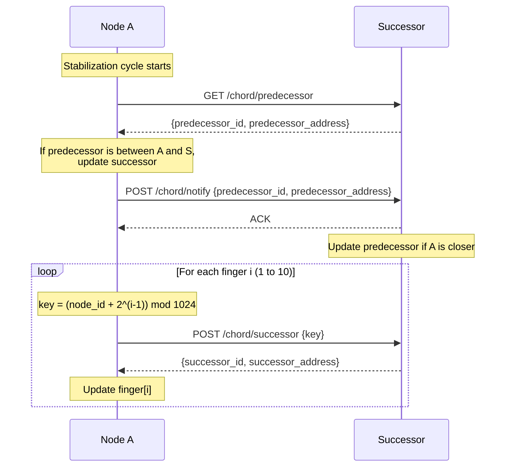

# Stabilization Process

After a node joins the ring, its pointers may be incomplete or stale, for example, a new node knows its successor but not its predecessor, and other nodes don't yet know about it. Stabilization is a periodic background protocol that each node runs to converge the ring to a correct state. It corrects successor and predecessor pointers, and refreshes finger table entries to maintain O(log N) routing efficiency.

Each node runs a stabilization cycle every 2 seconds (configurable).

## Cycle Overview

Each stabilization cycle performs three steps:

1. **Successor check**: Ask our successor for its predecessor. If that predecessor is between us and our successor, it's a better successor, adopt it.
2. **Notify**: Tell our successor that we exist, so it can update its predecessor pointer if appropriate.
3. **Finger table refresh**: For each of the 10 finger table entries, query the ring to find the correct successor and update the entry.

## Message Flow

The following diagram shows one stabilization cycle from Node A's perspective:



> **Note:** If the node is alone in the ring (successor is itself), the entire cycle is skipped.

## Step Details

### 1. Successor Check

The node queries its successor's predecessor via `GET /chord/predecessor`. If the successor has a predecessor that falls between us and the successor in the ring, that node is a better successor, so we update our successor pointer to it.

This handles the case where a new node joined between us and our successor: the new node became our successor's predecessor, and we discover it through this check.

If the successor has no predecessor (returns null) or its predecessor is not between us and our successor, no update is made.

**Components:** `NodeService._stabilize`, `ChordNode.should_update_successor`, `HttpTransport.get_predecessor`

### 2. Notify

After the successor check, the node sends a `POST /chord/notify` to its current successor (which may have just been updated in step 1). This tells the successor: "I might be your predecessor."

The successor accepts the notification if:

- It has no predecessor yet, or
- The notifying node is between its current predecessor and itself (i.e., closer).

If the predecessor is updated, the successor triggers key migration. It requests files from its own successor that now fall in its new responsibility range.

**Components:** `NodeService._stabilize`, `ChordNode.notify`, `NodeService.handle_notify`, `NodeService.migrate_keys_from_successor`

### 3. Finger Table Refresh

For each entry _i_ (1 to 10), the node computes a lookup key:

```python
key = (node_id + 2^(i-1)) mod 1024
```

It then queries the ring via `POST /chord/successor` to find which node is responsible for that key, and updates `finger[i]` with the result. This ensures that each finger entry points to the correct node for its range, enabling efficient O(log N) routing.

Individual finger refresh failures are logged and skipped. The remaining entries are still updated. Failed entries will be retried in the next cycle.

**Components:** `NodeService._refresh_fingers`, `FingerTable.get_refresh_targets`, `FingerTable.update`
